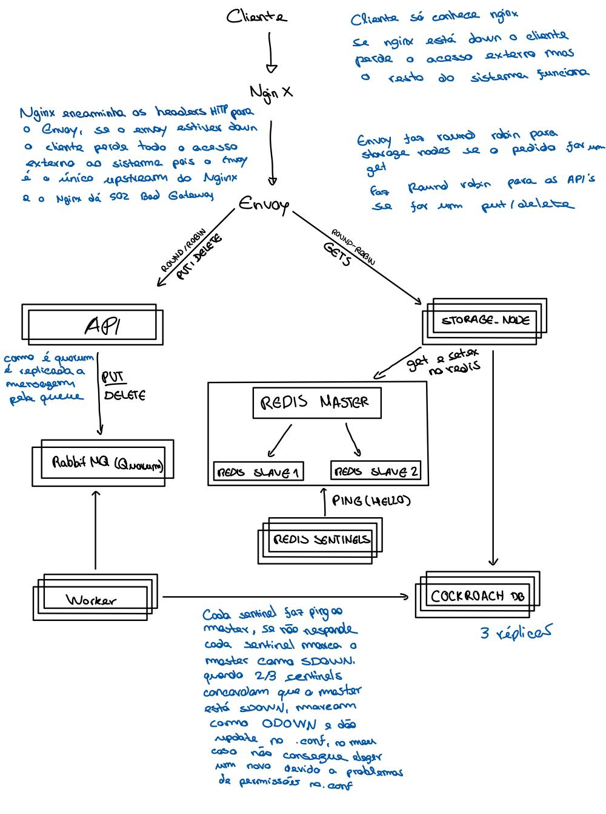

Diogo Paiva Almeida - 81477

# Sistemas Distribuídos SPD – Projeto “Key-Value Distribuído”

## 1. Visão Geral

Este repositório contém a implementação de um sistema de armazenamento distribuído de pares **key-value**, capaz de executar operações básicas (**PUT**, **GET**, **DELETE**) sobre múltiplos nós, garantindo disponibilidade, escalabilidade, tolerância a faltas e consistência.

## 2. Arquitetura do Sistema

O sistema segue um padrão de micro-serviços, organizado em clusters e com um reverse proxy na entrada.



> **Figura:** Ilustração dos componentes principais e dos fluxos de dados entre eles.

### Componentes

1. **Nginx**
   – Serviço de reverse proxy que recebe requisições HTTP, aplica health-check e encaminha o tráfego para o Envoy mantendo cabeçalhos essenciais.
2. **Envoy Proxy**
   – Docker container que executa o proxy Envoy v1.28 e um serviço FastAPI que funciona como API Gateway, enfileirando operações de escrita no RabbitMQ e encaminhando leituras para o nó de armazenamento.
3. **Cluster Redis**
   – Service que atua como Storage Node: gere operações sobre CockroachDB com cache Redis via Sentinel para aceleração de leituras.
4. **Cluster API**
   – Conjunto de instâncias que expõem a REST-API pública (`PUT`, `GET`, `DELETE`).
5. **Cluster Queue**
   – Camada de mensagens para orquestração de tarefas assíncronas (por ex., replicação, invalidation).
6. **Cluster Consumer**
   – Consumidores que processam eventos da fila.
7. **Cluster Base de Dados (BD)**
   – Repositório persistente para logs de operações e fallback de consistência.

## 3. ## Requisitos  
Para clonar e executar este repositório, só precisas de ter instalado no teu sistema:  
1. **Docker** (versão 20.10+).  
2. **Docker Compose** (versão 1.29+).  

Após isso, basta correr:
```bash
git clone <repo-url>
cd key-value-distribuido
./start.sh


## 4. Instalação e Setup

1. **Clone o repositório**

   ```bash
   git clone git@github.com:a66264/sistemas-distribuidos-spd.git
   cd sistemas-distribuidos-spd
   ```
2. **Configure variáveis de ambiente**
   Copie `.env.example` para `.env` e ajuste conforme necessário (portas, credenciais, endereços de cluster).
3. **Bootstrap e inicialização**

   ```bash
   chmod +x start.sh
   ./start.sh
   ```

   Este script:

   * Cria redes Docker
   * Inicia Nginx e Envoy
   * Levanta clusters de Redis, API, Queue, Consumer e BD
   * Executa health checks iniciais

## 5. Health Checks

* Cada serviço expõe um endpoint de health check em `/health`.

## 6. Qualidades pertinentes aos sistemas distribuídos

- **Concorrência**: todos os clusters são balanceados pelo Nginx/Envoy e utilizei timestamps nas KV para controlo de concorrência:
  - No **API Gateway**, cada operação PUT ou DELETE enfileirada no RabbitMQ inclui um campo `ts` com a data/hora UTC em ISO 8601 (`datetime.now(timezone.utc).isoformat()`).  
  - No **Storage Node**, a tabela SQL `kv_store` tem uma coluna `updated_at` onde se grava este timestamp sempre que ocorre um upsert (`ON CONFLICT DO UPDATE`).  
  - Se, por motivo de replicação ou reprocessamento, chegarem várias mensagens com o mesmo `key`, basta comparar o campo `updated_at`: só as mensagens com `ts` mais recente devem prevalecer, evitando que writes mais antigos sobrescrevam valores mais novos.  
  - Este esquema de timestamps garante ordenação causal das escritas em ambientes distribuídos, permitindo reconciliar conflitos e assegurar que o estado final reflita sempre a última atualização.  

- **Escalabilidade**: A arquitetura actual, com 3 workers, 2 instâncias da API Gateway, 2 filas RabbitMQ e 3 bases de dados (CockroachDB + Redis Sentinel), oferece boa **escalabilidade horizontal** pelos seguintes motivos:

   - **Workers independentes**  
   - Cada worker consome da fila quorum do RabbitMQ de forma autónoma. Podemos adicionar ou remover workers sem parar o sistema, aumentando a taxa de processamento de comandos PUT/DELETE conforme a carga.  
   - Se a latência de processamento aumentar, basta lançar mais réplicas dos workers para repartir o trabalho.

   - **Múltiplas instâncias da API Gateway**  
   - As 2 instâncias do FastAPI atrás do Nginx/Envoy garantem elevada disponibilidade e distribuição de carga nas chamadas HTTP de leitura e escrita.  
   - Podemos escalar horizontalmente (subir mais instâncias).

   - **Filas RabbitMQ em quorum**  
   - As 2 filas (clusters) em modo quorum replicam mensagens entre vários nós, garantindo tolerância a falhas e throughput elevado.  
   - O RabbitMQ permite ajustar o número de réplicas.

   - **Bases de dados distribuídas**  
   - **CockroachDB**: com 3 nós (replicação automática e rebalancing), oferece forte consistência e capacidade de servir reads e writes em paralelo. Acrescentar nós melhora a capacidade de escrita e leitura distribuída.  
   - **Redis Sentinel**: suporta failover automático do master Redis e réplicas de leitura. Podemos aumentar réplicas de leitura para escalar operações GET sem sobrecarregar o master.

   - **Desacoplamento entre componentes**  
   - As operações de escrita são enfileiradas e processadas de forma assíncrona, reduzindo o impacto das latências de disco ou bloqueios na BD.  
   - As leituras passam diretamente para o Storage Node via Envoy, podendo ser replicadas ou cacheadas (cache hit em Redis) sem afetar o fluxo de escrita.

   - **Balanço de carga e redundância**  
   - Nginx/Envoy distribui pedidos de forma round-robin ou por saúde da instância, permitindo remover nós em manutenção sem downtime.  
   - Cada componente (API, worker, fila, BD) pode crescer de forma independente: basta adicionar instâncias ao cluster correspondente.

      - Em suma, graças à separação de responsabilidades, ao uso de filas quorum, à replicação automática nas bases de dados e ao balanceamento de carga, essa configuração é altamente escalável: basta aumentar o número de réplicas de cada serviço conforme a carga aumenta, sem alterações significativas no código.  

* **Tolerância a faltas**: 
   - **Bases de dados (CockroachDB – 3 nós)**  
   - Cada nó armazena réplicas dos dados, com consenso automático de Raft para garantir consistência forte.  
   - Em caso de falha de um nó, os outros dois continuam a servir leituras e escritas sem interrupção.  
   - O rebalancing automático redistribui réplicas conforme adicionamos ou removemos nós, mantendo performance e durabilidade.

   - **Filas RabbitMQ (2 quorum queues)**  
   - Duas filas em modo *quorum* replicam mensagens entre vários nós, assegurando que cada mensagem é persistida em mínimo de metade dos membros antes de confirmar.  
   - Se um nó de fila cair, os restantes continuam a enfileirar e distribuir mensagens normalmente, sem perda ou duplicação.  
   - Podemos dimensionar horizontalmente adicionando mais nós à fila, melhorando throughput e resiliência.

   - **Redis Sentinel (3 sentinels + master + réplicas)**  
   - Três instâncias Sentinel monitorizam continuamente o nó master e as réplicas Redis.  
   - Ao detetar falha do master, ocorre eleição automática de um dos slaves para master secundário, sem intervenção manual.  
   - As aplicações (API Gateway e Storage Node) ligam-se ao endereço lógico fornecido pelos Sentinels, garantindo que passam a apontar sempre para o master ativo.  
   - Réplicas de leitura podem escalar as consultas GET, enquanto o master lida apenas com writes, aumentando desempenho e disponibilidade.

* **Consistência**: 
- **Consistência eventual**  
  - As escritas são enfileiradas no RabbitMQ e depois processadas assincronamente pelos workers, pelo que diferentes réplicas (CockroachDB, Redis) podem demorar alguns milissegundos a convergir para o mesmo estado.  
  - Este modelo permite alta disponibilidade e throughput, ao preço de aceitar leituras ligeiramente desatualizadas entre o momento do PUT e a propagação completa.

**10. Coordenação**
- **Timestamps para Ordenação Causal**  
  - Cada comando enfileirado (`publish_cmd`) inclui um campo `ts` com o timestamp UTC em ISO 8601, permitindo comparar a ordem real das escritas.  
  - No Storage Node, o `updated_at` em CockroachDB recebe exatamente este `ts`, garantindo que, mesmo em ambientes distribuídos, sabemos sempre qual foi a operação mais recente.  
  - Durante replicação ou reprocessamento de filas, os workers podem descartar mensagens cujo `ts` seja anterior ao `updated_at` atual na BD, evitando _out-of-order writes_.

- **Ordenação de Eventos (RabbitMQ)**  
  - As filas quorum do RabbitMQ garantem que mensagens são processadas pela ordem de chegada à queue.  
  - Combinado com os timestamps, isso assegura total consistência da sequência de eventos: primeiro o broker, depois a comparação `ts > updated_at` no consumer.


## 7. Uso em Cloud e Standalone

* **Standalone**: basta o `start.sh` em máquina GNU/Linux com Docker.
* **Cloud**: Cloud não suportada.

## Bibliografia

1. **van Steen, M. & Tanenbaum, A. S.** (2023; updated Jan. 2025). *Distributed Systems* (4ª ed., v. 4.03). distributed-systems.net. Disponível em: https://distributed-systems.net/index.php/books/ds4/  

2. **Envoy Proxy**. (2024). *Envoy – A high-performance C++ distributed proxy designed for single-services and applications*. Disponível em: https://www.envoyproxy.io/

3. **OpenAI ChatGPT**. (2023). *ChatGPT (GPT-4) – assistente de linguagem natural*. Utilizado para apoio na redação do relatório e implementação de partes do código.  

---

> **Demo:** Disponível em ambiente de staging via URL pública (ver arquivo `docs/demo.md`).
> **Repositório privado:** Acesso via GitHub a81477 (domínio ualg.pt).
